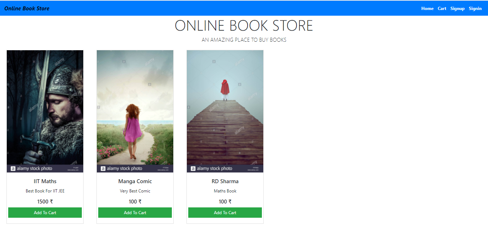

<h1 align="center"> Online Books Store Frontend </h1>

<div align="center">

[](https://app.netlify.com/sites/elated-kepler-edf536/deploys)

</div>

## To Run This Application 

```

npm install
npm start

```

## <h3 align="center"> <b> Project Images </b> </h3>

HomePage


SignUp Page


SignIn Page


Admin DashBoard


Create Category


<!-- Manage Category Remaining -->

Create Product


Manage Product


<!-- Cart Page Remaining -->
